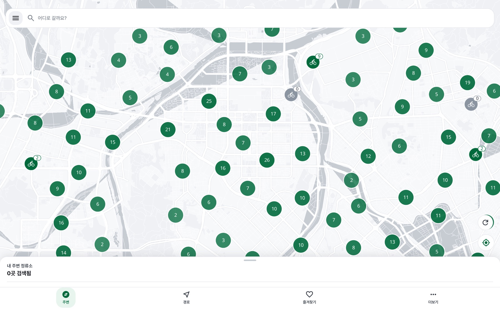

# 공공자전거 최적 경로 찾기

대전 '타슈'와 서울 '따릉이'의 가까운 정류소를 찾고, 자전거 경로를 안내하는 PWA 웹 앱입니다.

온라인 데모: https://jeric1223.github.io/PUBLIC-BIKE-ROUTE-FINDER/

[개발 후기 (velog)](https://velog.io/@hoohoo0889/%EB%8C%80%EC%A0%84-%ED%86%A0%EB%B0%95%EC%9D%B4-%EA%B0%9C%EB%B0%9C%EC%9E%90%EA%B0%80-%ED%83%80%EC%8A%88-%EC%93%B0%EB%8B%A4-%EB%B9%A1%EC%B3%90%EC%84%9C-%EB%A7%8C%EB%93%A0-%EC%95%B1-%EC%84%9C%EB%B2%84-%EB%B9%84%EC%9A%A9-0%EC%9B%90)

## 주요 기능

### 내 주변 정류소
- 현재 위치를 기준으로 가장 가까운 정류소를 자동으로 찾습니다.
- 정류소별 대여 가능 대수, 거리, 도보 시간을 보여줍니다. 서울은 반납 가능한 거치대 수도 함께 표시합니다.
- 하단 카드를 좌우로 넘기면 지도가 해당 정류소로 이동합니다.
- 데이터 기준 시각("N분 전 기준")을 표시합니다.

### 대전 / 서울 전환
- 상단 도시 칩에서 대전과 서울을 전환합니다. 도시별 브랜드 색(대전 주황, 서울 파랑)이 적용됩니다.
- 내 위치가 선택한 도시 밖이어도 해당 도시의 정류소를 둘러볼 수 있습니다.

### 경로 찾기
- 출발지와 목적지를 검색하면 출발지 근처 대여 정류소와 목적지 근처 반납 정류소를 골라 도보와 자전거 구간으로 나눠 보여줍니다.
- 카카오맵 또는 네이버지도로 길찾기를 이어서 시작할 수 있습니다.

### 즐겨찾기
- 자주 쓰는 정류소를 저장해 두고 빠르게 확인합니다.

### PWA
- 홈 화면에 설치할 수 있고, 오프라인에서도 기본 화면과 마지막 정류소 데이터를 볼 수 있습니다.

## 설치

- iOS: Safari에서 접속한 뒤 공유 버튼, "홈 화면에 추가"
- Android: Chrome에서 접속한 뒤 메뉴, "앱 설치"
- PC: Chrome 또는 Edge 주소창 오른쪽의 설치 버튼

## 사용 방법

1. 앱을 열고 위치 권한을 허용하면 가까운 정류소가 표시됩니다.
2. 상단 도시 칩으로 대전과 서울을 바꿀 수 있습니다.
3. 하단 "경로" 탭에서 출발지와 목적지를 입력해 경로를 계산합니다.
4. 정류소 카드의 별 버튼으로 즐겨찾기에 저장합니다.

## 데이터

별도 서버 없이 GitHub Actions가 매시 정각에 타슈 API와 서울 열린데이터광장 따릉이 API에서 정류소 정보를 받아 정적 JSON으로 만들고 GitHub Pages에 배포합니다.

## 기술 스택

React, TypeScript, Vite, Tailwind CSS, OpenLayers, Workbox

## 개발

개발 환경, 구조, 배포 방법은 [DEVELOPMENT.md](./DEVELOPMENT.md)를 참고하세요.

## 라이선스

MIT

## 문의

[GitHub Issues](https://github.com/Jeric1223/PUBLIC-BIKE-ROUTE-FINDER/issues)
